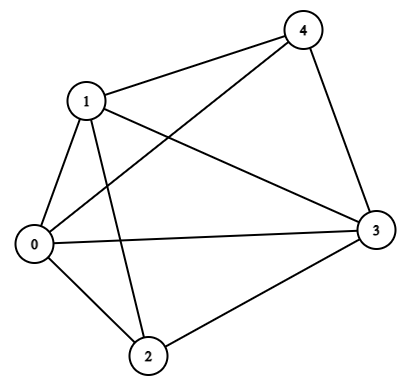
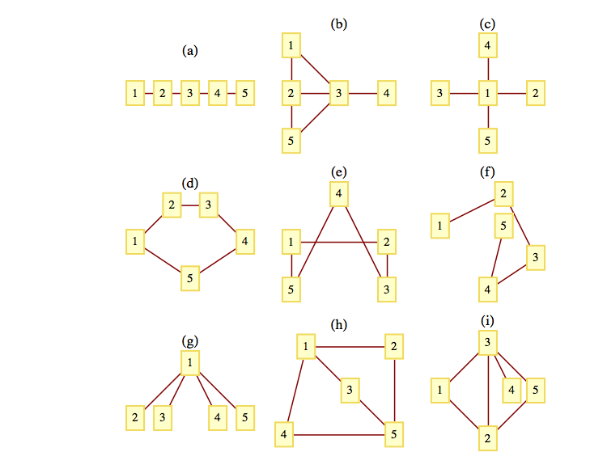
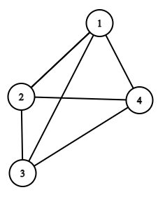
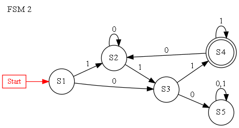
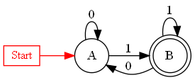

# CSE 280 Prove 6

(c) BYU-Idaho - It is an honor code violation to post this
file completed or uncompleted in a public file sharing site.

**Instructions**: Answer each question using proper markdown notation as needed.  Use the preview view in Visual Studio Code (or another editor if desired) to see the formatting, tables, and mathematical formula properly rendered.  If you need to write code, then first test your code in a separate file and then copy the code into this document using code fences. 

**Name**: Obe Megargel

**Section**: CSE 280

**Teacher**: Brother Macbeth

## Question 1 (5 points)

Fill in the adjacency table below for the graph below:



|Vertex|Adjacent Verticies|
|:-:|:-:|
|0|1,2,3,4|
|1|0,2,3,4|
|2|0,1,3|
|3|2,0,1,4|
|4|1,0,3|

## Question 2 (4 points)

The list of 9 graphs below have 4 pairs of isomorphic graphs.  Find the 4 pairs.  Note that one of the graphs does not have a match.



|#|Isomorphic Pairs|
|:-:|:-:|
|1st Pair|(d, e)|
|2nd Pair|(a, f)|
|3rd Pair|(b, i)|
|4th Pair|(g, c)|

Source: Question adapted from Applied Discrete Structures by Alan Doerr & Kenneth Levasseur which is licensed under a Creative Commons Attribution-NonCommercial-ShareAlike 3.0 United States License.

## Question 3 (15 points)

Write python code to create an adjacency table for the undirected graph below.  Second, implement the `find_neighbors` function which will take as input vertex and the adjaceny table and returns a list of verticies that are adjacent to the input vertex.  Finally, implement the `is_neighbor` which takes two verticies and the adjaceny table and returns True if they are adjacent; False otherwise.


```python
#%%
adjacency_table = {"A":(["B", "C"]),
                   "B":(["A", "C"]),
                   "C":(["B", "A", "D"]),
                   "D":(["C", "F", "E"]),
                   "E":(["D", "F"]),
                   "F":(["D", "E"])}
#%%
def find_neighbors(vertex, adjacency_table):
    # Add your code here
    state = vertex
    state = adjacency_table[vertex]
    
    return state
#%%
def is_neighbor(vertex1, vertex2, adjacency_table):
    # Add your code here
    result = False
    state = adjacency_table[vertex1]
    for i in state:
        if i == vertex2:
            result = True
    return result
#%%
print(find_neighbors('A', adjacency_table)) # should print ['B', 'C']
print(find_neighbors('D', adjacency_table)) # should print ['C', 'E', 'F']

print(is_neighbor('A','B',adjacency_table)) # True
print(is_neighbor('D','F',adjacency_table)) # True
print(is_neighbor('C','F',adjacency_table)) # False
```

## Question 4 (6 points)

Determine if the graph below has an Euler Circuit.  If it does, then write down the sequence of verticies that make up the Euler Circuit.  If it does not, then write "No Euler Cycle"

|Graph|Euler Cycle|
|:-:|:-:|
||No Euler Cycle|
||(1,6,4,3,2,1,5,4,1)|
||(1,5,6,2,9,10,3,7,12,11,6,7,8,4,3,2,1)|

## Question 5 (20 points)

Complete the tables below to identify the final state (per the FSM diagram) and whether that final state was an accepting state for each of the inputs.   

**Part 1**


|Input|Final State|Accepting (Yes/No)|
|:-:|:-:|:-:|
|00101|D|no|
|011100|C|yes|
|01111|B|no|
|0101|D|no|
|00000|C|Yes|
|11111|D|no|
|11100|D|no|
|10011|D|no|

**Part 2**



|Input|Final State|Accepting (Yes/No)|
|:-:|:-:|:-:|
|00101|S5|no|
|011100|S2|no|
|01111|S4|yes|
|0101|S3|no|
|00000|S5|no|
|11111|S4|yes|
|11100|S2|no|
|10011|S4|yes|

## Question 6

Describe the bit string recognized/accepted by the following FSM:



Answer: I has at least one "1" and never has a zero after the last "1".